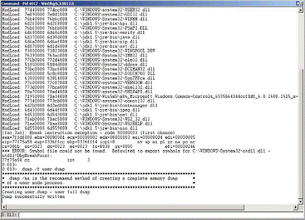

## Java HotSpot VM Command-Line Options

Command-line options that are prefixed with `-XX` are specific to the Java HotSpot Virtual Machine. Many of these options are important for performance tuning and diagnostic purposes, and are therefore described in this appendix. For information on all possible `-XX` options, see the[Java HotSpot VM Options](http://www.oracle.com/technetwork/java/javase/tech/vmoptions-jsp-140102.html).

You can dynamically set, unset, or change the value of certain Java VM flags for a specified Java process using the `jinfo -flag` command. See [The jinfo Utility](https://docs.oracle.com/javase/8/docs/technotes/guides/troubleshoot/tooldescr013.html) and the [JConsole](https://docs.oracle.com/javase/8/docs/technotes/guides/troubleshoot/tooldescr009.html) utility.

For a complete list of these flags, use the **MBeans** tab of the JConsole utility. See the list of values for the `DiagnosticOptions` attribute of the `HotSpotDiagnostic` MBean, which is in the `com.sun.management` domain. The following are the flags:

* `HeapDumpOnOutOfMemoryError`

* `HeapDumpPath`

* `PrintGC`

* `PrintGCDetails`

* `PrintGCTimeStamps`

* `PrintClassHistogram`

* `PrintConcurrentLocks`

### The -XX:HeapDumpOnOutOfMemoryError Option

This option tells the Java HotSpot VM to generate a heap dump when an allocation from the Java heap or the permanent generation cannot be satisfied. There is no overhead in running with this option, so it can be useful for production systems where the `OutOfMemoryError` exception takes a long time to surface.

You can also specify this option at runtime with the **MBeans** tab in the[JConsole](https://docs.oracle.com/javase/8/docs/technotes/guides/troubleshoot/tooldescr009.html) utility.

The heap dump is in HPROF binary format, and so it can be analyzed using any tools that can import this format. For example, the `jhat` tool can be used to do rudimentary analysis of the dump. For more information on the `jhat` tool, see [The jhat Utility](https://docs.oracle.com/javase/8/docs/technotes/guides/troubleshoot/tooldescr012.html).

[Example D-1]() shows the result of running out of memory with this flag set.

> Example D-1 Sample Code for Running Out of Memory

```
$ java -XX:+HeapDumpOnOutOfMemoryError -mn256m -mx512m ConsumeHeap

java.lang.OutOfMemoryError: Java heap space
Dumping heap to java_pid2262.hprof ...
Heap dump file created [531535128 bytes in 14.691 secs]
Exception in thread "main" java.lang.OutOfMemoryError: Java heap space
        at ConsumeHeap$BigObject.(ConsumeHeap.java:22)
        at ConsumeHeap.main(ConsumeHeap.java:32)

```

The `ConsumeHeap` fills up the Java heap and runs out of memory. When the `java.lang.OutOfMemoryError` exception is thrown, a heap dump file is created. In this case the file is 507 MB and is created with the name java_pid2262.hprof in the current directory.

By default the heap dump is created in a file called java_pidpid.hprof in the working directory of the VM, as in the example above. You can specify an alternative file name or directory with the `-XX:HeapDumpPath=` option. For example `-XX:HeapDumpPath=/disk2/dumps` will cause the heap dump to be generated in the `/disk2/dumps` directory.

### The -XX:OnError Option

When a fatal error occurs, the Java HotSpot VM can optionally execute a user-supplied script or command. The script or command is specified using the `-XX:OnError=`string command-line option, where string is a single command, or a list of commands separated by semicolons. Within this string, all occurrences of `%p` are replaced with the current PID, and all occurrences of `%%` are replaced by a single `%`. The following examples demonstrate how this option can be used when launching a Java application named MyApp with the `java` launcher.

* `java -XX:OnError="pmap %p" MyApp`

  On Oracle Solaris operating system the `pmap` command displays information about the address space of a process. In the example above, if a fatal error occurs, the `pmap` command is executed to display the address space of the current process.

* `java -XX:OnError="cat hs_err_pid%p.log | mail support@acme.com" MyApp`

  In the example above, the contents of the fatal error log file are mailed to a support alias when a fatal error is encountered.

* `java -XX:OnError="gcore %p; dbx - %p" MyApp`

  On Oracle Solaris operating system the `gcore` command creates a core image of the specified process, and the `dbx` command launches the debugger. In the example above, the `gcore` command is executed to create the core image of the current process, and the debugger is started to attach to the process when an unexpected error is encountered.

* `java -XX:OnError="gdb - %p" MyApp`

  On Linux the `gdb` command launches the debugger. In the example above, the `gdb` debugger is launched and attached to the current process when an unexpected error is encountered.

* `java -XX:OnError="userdump.exe %p" MyApp`

  On Windows the `userdump.exe` utility creates a crash dump of the specified process. The utility does not ship with Windows and should be downloaded from the Microsoft website as a part of the Microsoft OEM Support Tools package.

  In the above example, the `userdump.exe` utility is executed to create a core dump of the current process in case of a fatal error.

> **Note:**

> The example assumes that the path to the `userdump.exe` utility is defined in the `PATH` variable.</td>

> Tip

> If you do not have the `userdump.exe` utility installed, the Dr. Watson debugger can be configured as the post-mortem debugger so that a crash dump is created when an unexpected error is encountered.


For more information on creating crash dumps on Windows, see[Collect Crash Dumps on Windows](https://docs.oracle.com/javase/8/docs/technotes/guides/troubleshoot/bugreports004.html).

### The -XX:ShowMessageBoxOnError Option

When this option is set and a fatal error is encountered, the HotSpot VM will display information about the fatal error and prompt the user to specify whether the native debugger is to be launched. In the case of Oracle Solaris and Linux operating systems, the output and prompt are sent to the application console (standard input and standard output). In the case of Windows, a Windows message box pops up.

[Example D-2]() shows a fatal error encountered on a Linux system.

> Example D-2 Fatal Error on a Linux System

```
====================================================================
Unexpected Error
--------------------------------------------------------------------
SIGSEGV (0xb) at pc=0x2000000001164db1, pid=10791, tid=1026

Do you want to debug the problem?

To debug, run 'gdb /proc/10791/exe 10791'; then switch to thread 1026
Enter 'yes' to launch gdb automatically (PATH must include gdb)
Otherwise, press RETURN to abort...
====================================================================

```

In this case a `SIGSEGV` error has occurred and the user is prompted to specify whether the `gdb` debugger is to be launched to attach to the process. If the user enters `y` or `yes`, `gdb` will be launched (assuming it is set in the `PATH` variable).

On Oracle Solaris operating system the message is similar to the above except that the user is prompted to start the `dbx` debugger.

On Windows a message box is displayed. If the user clicks **Yes**, the VM will attempt to start the default debugger. This debugger is configured by a registry setting which is described in[Collect Crash Dumps on Windows](https://docs.oracle.com/javase/8/docs/technotes/guides/troubleshoot/bugreports004.html). If Microsoft Visual Studio is installed, the default debugger is typically configured to be `msdev.exe`.

In the above example the output includes the PID (`pid=10791`) and also the thread ID (`tid=1026`). If the debugger is launched, one of the initial steps in the debugger might be to select the thread and obtain its stack trace.

As the process is waiting for a response it is possible to use other tools to obtain a crash dump or query the state of the process. On Oracle Solaris operating system, for example, a core dump can be obtained using the `gcore` utility.

On Windows a Dr. Watson crash dump can be obtained using the `userdump` or `windbg` programs. The `windbg` utility is included in Microsoft's Debugging Tools for Windows and is described in [Collect Crash Dumps on Windows](https://docs.oracle.com/javase/8/docs/technotes/guides/troubleshoot/bugreports004.html). In `windbg`, select the **Attach to a Process** menu option, which displays the list of processes and prompts for the PID. The HotSpot VM displays a message box, which includes the PID. Once selected the `.dump /f` command can be used to force a crash dump. [Figure D-1]() is an example crash dump created in a file named `crash.dump`.

> **_Figure D-1 Example of a Crash Dump Created by windbg_**



In general the `-XX:+ShowMessageBoxOnError` option is more useful in a development environment where debugger tools are available. The `-XX:OnError` option is more suitable for production environments where a fixed sequence of commands or scripts are executed when a fatal error is encountered.

### Other -XX Options

Several other `-XX` command-line options can be useful in troubleshooting:

* `-XX:OnOutOfMemoryError``=string`

  This option can be used to specify a command or script to execute when an `OutOfMemoryError` exception is thrown.

* `-XX:ErrorFile``=filename`

  This option can be used to specify a location for the fatal error log file, see[Location of Fatal Error Log](https://docs.oracle.com/javase/8/docs/technotes/guides/troubleshoot/felog001.html).

* `-xx:HeapDumpPath``=path`

  This option can be used to specify a location for the heap dump, see [The -XX:HeapDumpOnOutOfMemoryError Option]().

* `-XX:MaxPermSize``=size`

This option can be used to specify the size of the permanent generation memory, see [Exception in thread thread_name: java.lang.OutOfMemoryError: GC Overhead limit exceeded](https://docs.oracle.com/javase/8/docs/technotes/guides/troubleshoot/memleaks002.html).

* `-XX:+PrintCommandLineFlags`

This option can be used to print all the VM command-line flags, see [Collect Data for a Bug Report](https://docs.oracle.com/javase/8/docs/technotes/guides/troubleshoot/bugreports003.html).

* `-XX:+PrintConcurrentLocks`

This option can be used to cause the Control+Break handler to print a list of concurrent locks owned by each thread.

* `-XX:+PrintClassHistogram`

This option can be used to cause the Control+Break handler to print a heap histogram.

* `-XX:+PrintGCDetails` and`-XX:+PrintGCTimeStamps`

These options can be used to print detailed information about garbage collection, see [The -verbose:gc Option](21_02_Other_Command-Line_Options.md).

* `-XX:+UseAltSigs`

On Oracle Solaris 8 and 9 operating system, this option can be used to instruct the HotSpot VM to use alternate signals to `SIGUSR1` and `SIGUSR2`, see [Handle Signals on Oracle Solaris and Linux](https://docs.oracle.com/javase/8/docs/technotes/guides/troubleshoot/signals001.html).

* `-XX:+UseConcMarkSweepGC` , `-XX:+UseSerialGC` and `-XX:+UseParallelGC`

These options can be used to specify the garbage collection policy to be used, see [Working Around Crashes during Garbage Collection](https://docs.oracle.com/javase/8/docs/technotes/guides/troubleshoot/crashes002.html).


<https://docs.oracle.com/javase/8/docs/technotes/guides/troubleshoot/clopts001.html>
